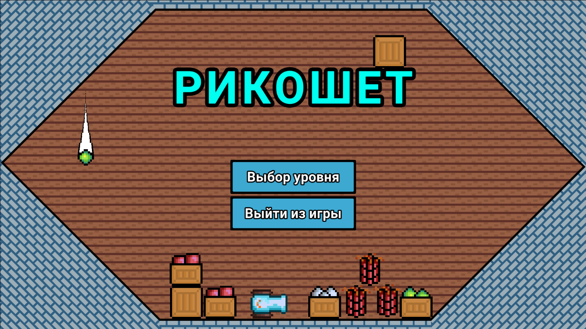

# 2D Игра "Рикошет"

Этот проект разработан на платформе Unity и предоставляет игрокам игровой процесс, который включает в себя стрельбу снарядами с различными свойствами из пушки для уничтожения бомб и преодоления препятствий.

## Паттерны проектирования
В проекте применены следующие паттерны проектирования:
1. **Стратегия:** Управляет поведением снарядов при попадании.
2. **Синглтон:** Гарантирует наличие единственного экземпляра класса ProjectileGun.

## Интерфейсы и классы
### Интерфейс IHitReaction
Интерфейс IHitReaction определяет метод Activate, который отвечает за реакцию на удар снаряда.
### Реализации интерфейса IHitReaction
1. **SimpleReaction:** Наносит урон и исчезает.
2. **ReflectReaction:** Наносит урон и отскакивает от поверхностей.
3. **ExplodeReaction:** Взрывается при попадании, создавая три рикошетирующих снаряда.

### Абстрактный класс Projectile
Все снаряды наследуются от абстрактного класса Projectile, который содержит реакцию на удар, определяемую интерфейсом IHitReaction.
- **SimpleProjectile:** Использует SimpleReaction, которая наносит урон и исчезает.
- **ReflectProjectile:** Использует ReflectReaction, которая наносит урон и отскакивает от поверхностей. Количество рикошетов настраивается через переменную ricochetCount.
- **ExplodeProjectile:** Использует ExplodeReaction, которая взрывается при попадании, создавая три рикошетирующих снаряда. Разброс снарядов регулируется переменной spread.

### Класс ProjectileGun
Класс ProjectileGun реализует паттерн Синглтон, обеспечивая наличие единственного экземпляра пушки в игре.

### Абстрактный класс HitObject
Абстрактный класс, представляющий объекты, которые могут быть разрушены. Содержит массив объектов, которые спавнятся при разрушении.

### Реализации классов HitObject
- **WinObject:** Уничтожение этого объекта приводит к победе в игре.
- **WeakWall:** Потрескавшаяся стена, которая может быть разрушена.

## Геймплей
Основная цель игры — уничтожить бомбу, используя ограниченное количество снарядов. Каждый снаряд обладает уникальными характеристиками, которые необходимо учитывать для успешного выполнения задач. Игрокам также предлагается собирать различные бонусы, которые облегчают прохождение уровней.

## Снаряды
В игре представлены три типа снарядов:
1. **Обычный снаряд:** Летит по прямой траектории и наносит урон при попадании.
2. **Рикошетирующий снаряд:** Наносит урон и отскакивает от поверхностей при попадании.
3. **Взрывной снаряд:** Взрывается при попадании, нанося урон и создавая три рикошетирующих снаряда.
### Бонусы
На уровнях могут появляться следующие бонусы:
1. **Динамит:** Взрывает случайную потрескавшуюся стену.
2. **Ящик с боеприпасами:** Увеличивает количество текущих снарядов.
3. **Ящик со снарядами:** Заменяет текущий тип снаряда на другой (обычный, рикошетирующий или взрывной).
### Разрушаемые объекты
Некоторые объекты на уровнях могут быть разрушены, включая потрескавшиеся стены, из которых могут выпадать бонусы или происходить другие события, такие как появление снаряда.

## Установка и запуск
Для запуска игры выполните следующие шаги:
1. Клонирование репозитория:
```bash
    git clone https://github.com/Telanors/ricochet.git
```
2. Открытие проекта:
- Откройте Unity Hub.
- Нажмите на кнопку "Open Project" и выберите папку с клонированным репозиторием.

3. Постройка и запуск:
- В Unity Editor, откройте меню File > Build Settings.
- Выберите целевую платформу и нажмите "Build and Run" для создания и запуска игры.


## Демонстрация
### Скриншоты игры



### Видео: 
https://disk.yandex.ru/d/EaYCZcJWWRkGZQ